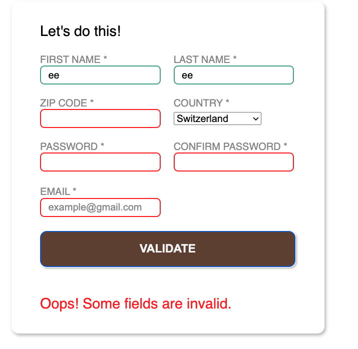

# JavaScript-form-validation 

This project focuses on performing form validation on the frontend with JavaScript, including the constraint validation API. The form collects Email, Country, Zip Code, Password and Password Confirmation fields. It use live inline validation to inform the user whether a field is properly filled in or not.

## Table of Contents

- Demo
- Technologies Used
- Credits

## Demo

Check out the [**live**](https://elsiechen.github.io/JavaScript-form-validation /) demo.

## Technologies Used

- HTML
- CSS
- JavaScript

## Credits

- The Odin Project: [Form Validation With JavaScript](https://www.theodinproject.com/lessons/node-path-javascript-form-validation-with-javascript#practice)

